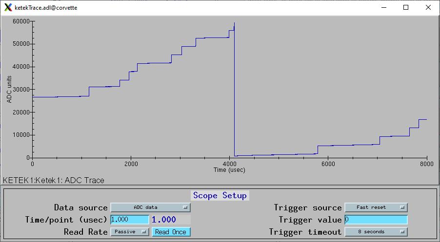
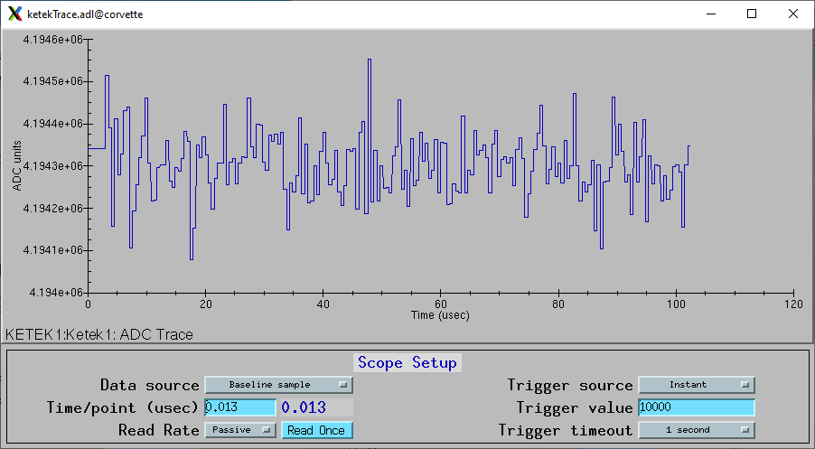
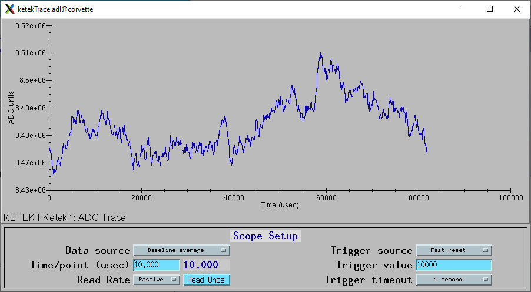
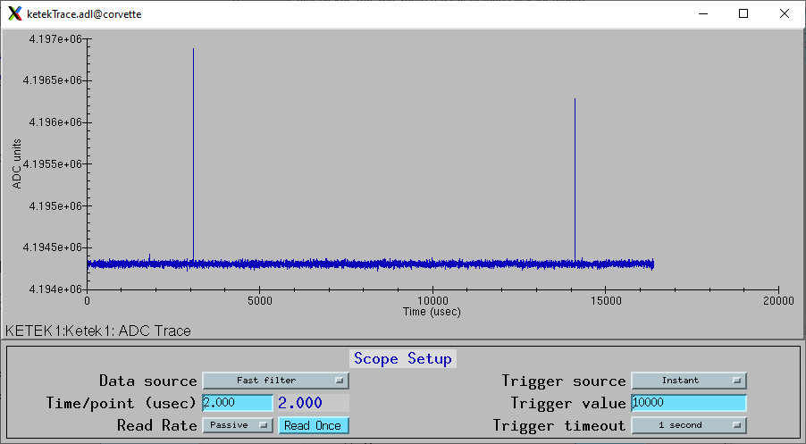

Diagnostic scope traces
-----------------------
The Ketek can collect diagnostic scope traces of pre-amp input signal and the outputs of several stages of the digital pulse processing.
These are very useful for diagnosing issues with the input and examining the outputs of the various digital filters.

The trace can be collected instantly when the ScopeRead record is processed, or after a specific trigger condition is satisfied.
If there is a trigger then it will be in in the middle of the trace, i.e. at point 4096, so there are equal numbers of
pre-trigger and post-trigger samples.

These are the records to control diagnostic traces. The records are contained in ketek.template.

.. cssclass:: table-bordered table-striped table-hover
.. list-table::
   :header-rows: 1
   :widths: auto

   * - EPICS record names
     - Record types
     - drvInfo string
     - Description
   * - ScopeRead
     - bo
     - KetekScopeRead
     - Arms the system to capture trace data on the next trigger event.
   * - ScopeData
     - waveform
     - KetekScopeData
     - Waveform record containing the diagnostic trace data. 8192 elements, 32-bit integer data type.
   * - ScopeTimeArray
     - waveform
     - KetekScopeTimeArray
     - Waveform record containing the time values for each point in ScopeData. 64-bit float data type.
   * - ScopeInterval, ScopeInterval_RBV
     - ao, ai
     - KetekScopeInterval
     - Time per sample of the scope trace data in microseconds. Allowed range is 0.0125 to 819.2.
   * - ScopeDataSource, ScopeDataSource_RBV
     - mbbo, mbbi
     - KetekScopeDataSource
     - The type of data to be captured.  Choices are:

       - ADC data
       - Fast filter
       - Medium filter
       - Slow filter
       - Baseline average
       - Baseline sample
   * - EventTriggerSource, EventTriggerSource_RBV
     - mbbo, mbbi
     - KetekEventTriggerSource
     - The trigger event to wait for.  Choices are:

       - Instant
       - ADC value
       - ADC out of range
       - Fast trigger
       - Fast reset
       - Fast pileup
       - Medium trigger
       - Medium reset
       - Medium pileup
       - Output count
       - Output Energy
       - Baseline sample
       - Dyanamic reset
   * - EventTriggerValue, EventTriggerValue_RBV
     - longout, longin
     - KetekEventTriggerValue
     - The trigger value.
   * - ScopeTriggerTimeout, ScopeTriggerTimeout_RBV
     - ao, ai
     - KetekScopeTriggerTimeout
     - The timeout to wait for the trigger to occur after ScopeRead is processed.  Choices are [1, 2, 4, 8, 16] seconds.

The following are the MEDM screen ketekTrace.adl displaying several diagnostics traces. These were done with a Cd109 source,
which produces Ag K x-rays.  

The following trace was done with ScopeDataSource="ADC data", ScopeInterval=1.0 microseconds, EventTriggerSource="Fast reset".
The total time is 8192 microseconds. The reset event is a time=4096 microseconds, in the middle of the trace.
The small positive steps are the Ag K X-ray events.

The following trace was done with ScopeDataSource="Baseline sample", ScopeInterval=0.0125 microseconds, EventTriggerSource="Instant".
The total time is 102.4 microseconds.

The following trace was done with ScopeDataSource="Baseline average", ScopeInterval=10.0 microseconds, EventTriggerSource="Fast reset".
The total time is 80192 microseconds.

The following trace was done with ScopeDataSource="Fast filter", ScopeInterval=2.0 microseconds, EventTriggerSource="Instant".
The total time is 16384 microseconds.

