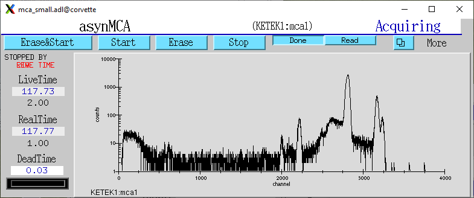
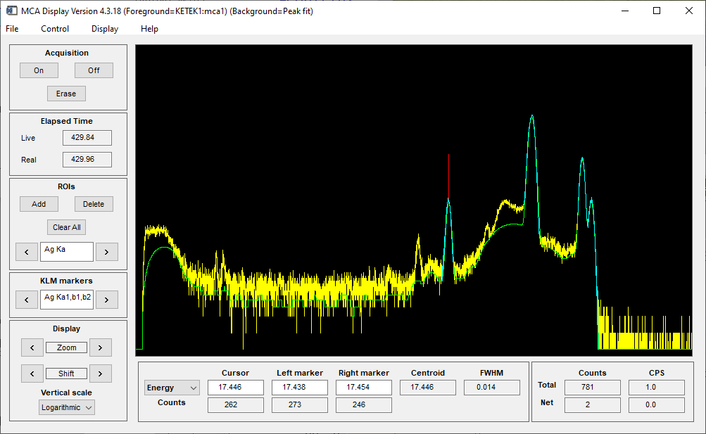

MCA mode
--------
The MCA mode collects a single MCA record at a time.  It is compatible with the MCA record, and is the same
as MCA operation on many other EPICS MCAs, e.g. Dante, Canberra AIM, Amptek, XIA (Saturn, Mercury, xMAP, FalconX), SIS38XX, and others.

The following parameters are in ketek.template control the preset mode. 

.. cssclass:: table-bordered table-striped table-hover
.. list-table::
   :header-rows: 1
   :widths: auto

   * - EPICS record names
     - Record types
     - drvInfo string
     - Description
   * - PresetMode, PresetMode_RBV
     - mbbo, mbbi
     - KetekPresetMode
     - The preset mode.  Choices are None, Live time, Real time, Input counts, and Output counts.
   * - mca1.PRTM
     - mca
     - MCA_PRESET_REAL
     - The preset real time.
   * - mca1.PLTM
     - mca
     - MCA_PRESET_LIVE
     - The preset live time.
   * - PresetInputCounts, PresetInputCounts_RBV
     - longout, longin
     - KetekPresetInputCounts
     - Preset input counts
   * - PresetOutputCounts, PresetOutputCounts_RBV
     - longout, longin
     - KetekPresetOutputCounts
     - Preset output counts

If PresetMode=None then it will count until manually stopped.
 
The following is the MEDM screen mca.adl displaying the MCA spectrum as it is acquiring.

The following is the IDL MCA Display program showing the MCA spectrum as it is acquiring. This GUI allows defining ROIs
graphically, fitting peaks and background, and many other features.

