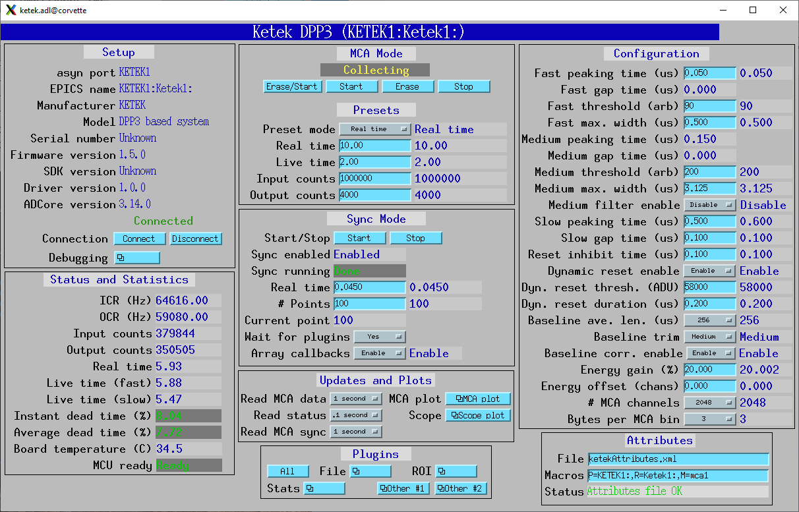

.. _ketek_module:      https://github.com/epics-modules/ketek
.. _mca:               https://github.com/epics-modules/mca
.. _asyn:              https://github.com/epics-modules/asyn
.. _asynNDArrayDriver: https://areadetector.github.io/areaDetector/ADCore/NDArray.html#asynndarraydriver
.. _areaDetector:      https://areadetector.github.io
.. _KETEK:             https://ketek.net
.. _read_nd_hdf5:      https://github.com/CARS-UChicago/IDL_Detectors/blob/master/read_nd_hdf5.pro

Overview
--------

This is an EPICS driver for the KETEK_ digital x-ray spectroscopy systems equippped with KETEK digital pulse process DPP3.
The source code is in the ketek_module_ repository in the Github epics-modules project.
These detectors are available in single channel (AXAS-D 3.0 or VICO-DV 3.0) and multichannel (ARRAY) versions.
This module currently only supports the single channel versions.

The Ketek can collect data in 3 different modes:

- Single MCA spectrum.  It acquires a single MCA spectrum on all channels.
- Sync.  It acquires multiple spectra in rapid succession, and it often used for making an x-ray map where there is an MCA
  spectrum for each channel at each pixel.  The advance to the next pixel comes from an external trigger.  In this mode the 
  Ketek detector opens a UDP port on the IOC host and streams the sync mode data to it.
- Diagnostic trace mode.  This shows the ADC data or outputs of various stages of the digital pulse processing for diagnostics.

The driver implements the mca interface from the EPICS mca_ module.
The EPICS mca record is used to configure the preset live and real times, to report the elapsed live time, realtime, and deadtime, 
to display the spectra and control the basic operation including Regions-of-Interest (ROIs).

The Ketek driver is derived from the base class asynNDArrayDriver_, which is part of the EPICS areaDetector_ package.
The allows the Ketek driver to use all of the areaDetector plugins for file saving in sync mode,
and for other purposes. 
The Ketek driver can be used on both Windows and Linux. 
New firmware can be uploaded using the vendor's VICOUpdate tool which is part of the KETEK software installation package for Windows and Linux.

This document does not attempt to give an explanation of the principles of operation of the Ketek, or a detailed explanation
of the many configuration parameters for the digital pulse processing.  The user should consult the following documents for this information:

- :download:`KETEK DPP3 Manual <KETEK DPP3 Manual rev._0.9.pdf>`
- :download:`Basic Communication <DPP3_Basic_Communication_rev._1.0.pdf>`
- :download:`Complete Parameter Set <DPP3_Complete_Parameter_Set_Overview_09-Apr-2025.pdf>`
- :download:`Sync Parameter Overview <DPP3_Sync_Parameter_Overview_27-July-2023.pdf>`
- :download:`Sync Mode UDP Packet Structure <Sync_Mode_UDP_Packet_Structure_6-Sept-2024.pdf>`

The following is the main MEDM screen ketek.adl. It provides control over all features except the diagnostic scope mode.

|

These are the records whose .SCAN fields control the update rates in different modes.

.. cssclass:: table-bordered table-striped table-hover
.. list-table::
   :header-rows: 1
   :widths: auto

   * - EPICS record names
     - Record types
     - drvInfo string
     - Description
   * - mca1Read
     - bo
     - N.A.
     - The rate to read the MCA spectrum in MCA mode.
   * - ReadStatus
     - bo
     - KetekReadStatus
     - The rate to read the MCA record status, the BoardTemperature, and the MCUReady status.
   * - SyncReadMCA
     - bo
     - N.A.
     - This rate to process the MCA record to display the sync mode spectra.  This is useful for monitoring
       the MCA spectra during a sync mode acquisition.
