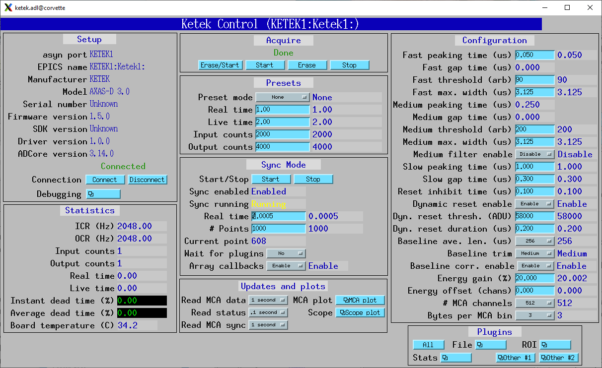
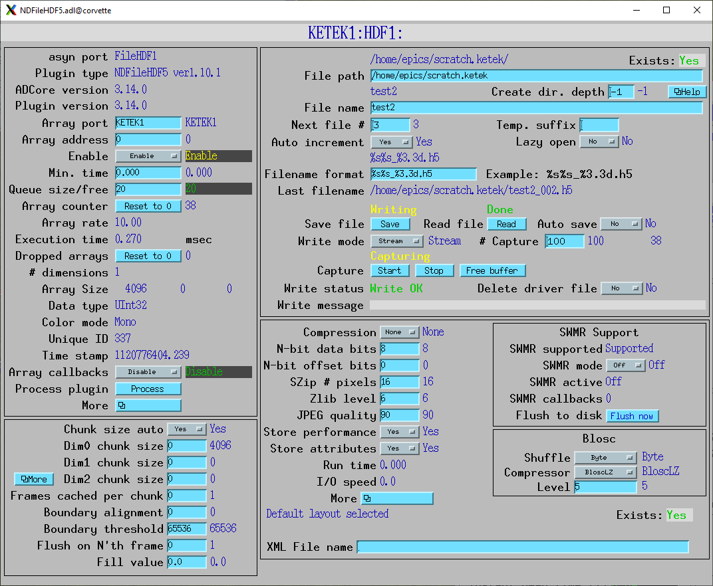
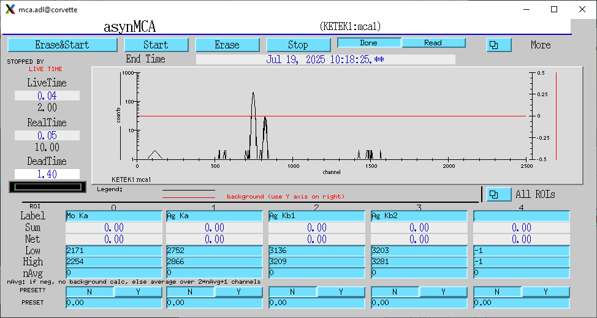

Sync or MCA mapping mode
------------------------
The Ketek can collect spectra in what they call "sync" mode.  For other detectors this is generally called MCA Mapping Mode.
It is used to rapidly collect spectra in response to an external trigger signal that is provided to the TRIG input on the DPP3 based hardware.

In sync mode the Ketek streams data to a UDP port on the IOC computer.  The IP address of the IOC and the UDP port to use are parameters
to the KetekConfigure command in the startup script.

This driver inherits from the base class asynNDArrayDriver in areaDetector/ADCore.
It implements the ArrayCallbacks and WaitForPlugins like most areaDetector drivers.
The driver reads the spectra and metadata from the UDP port and copies it into NDArrays of dimensions [NumMCAChannels]. 
The run-time statistics for each spectrum are copied into NDAttributes attached to each
NDArray.  The data type of the NDArray depends on the value of the BytesPerBin configuration parameter.
It will be NDUInt8, NDUInt16, or NDUInt32 for BytesPerBin = 1, 2, or 3.

The data can be displayed in the MCA record when a sync mode run is in progress.
This is done by setting SyncReadMCA.SCAN to a periodic scan rate.

The NDArrays can be used by any of the standard areaDetector plugins.  For example, they can be streamed
to HDF5, netCDF, or TIFF files.

These are the records for Sync/MCA Mapping Mode.  They are contained in ketek.template.

.. cssclass:: table-bordered table-striped table-hover
.. list-table::
   :header-rows: 1
   :widths: auto

   * - EPICS record names
     - Record types
     - drvInfo string
     - Description
   * - SyncAcquire, SyncAcquire_RBV
     - busy, bi
     - KetekSyncAcquire
     - Writing 1 to this record start a sync mode acquisition, and writing 0 stops the acquisition.
   * - SyncCycleTime, SyncCycleTime_RBV
     - ao, ai
     - KetekSyncCycleTime
     - The acquisition time in sync mode.  This is the time that the Ketek will acquire for after receiving a trigger pulse.
       The time between external trigger pulses must be less than this value.
   * - SyncPoints, SyncPoints_RBV
     - longout, longin
     - KetekSyncPoints
     - The number of spectra to collect in sync mode.  The driver will stop acquisition automatically after this number of spectra
       have been collected.
   * - SyncCurrentPoint
     - longin
     - KetekSyncCurrentPoint
     - The current sync cycle number, i.e. the number of spectra collected so far.
   * - SyncEnabled
     - bi
     - KetekSyncEnabled
     - A flag that indicates that sync mode is correctly configured to stream data to the IOC machine over UDP.
   * - SyncRunning
     - bi
     - KetekSyncRunning
     - A flag that indicates that sync mode is currently active.  This is read from the hardware.
   * - SyncReadMCA
     - bo
     - N.A.
     - This record can be periodically scanned to cause the MCA record to display the sync mode spectra.  This is useful for monitoring
       the MCA spectra during a sync mode acquisition.

The following is the MEDM screen ketek.adl when the Ketek is collecting in sync mode.

|

The following is the MEDM screen NDFileHDF5.adl when the Ketek is saving sync mode data to an HDF5 file.

|

The iocKetek directory contains the following files.

- ``ketekAttributes.xml``  This file defines NDAttributes that will be attached to each NDArray in sync mode.  
  These include all of the configuration parameters such as SyncCycleTime, SlowPeakingTime, etc.  
  They also include the MCA record energy calibration coefficients.
- ``ketek_hdf_layout.xml``  This file defines the location of the data and each of the attributes in the HDF5 file.

This example puts the MCA data in ``/exchange/data``.  The counting statistics are put in /exchange/RealTime ``/exchange/LiveTime``, etc.
The statistics are saved with OnFileWrite, so they are saved for each spectrum in the file.
The configuration attributes defined in `ketekAttributes.xml` are saved in ``/KetekParameters``, and are saved with OnFileClose, so they
are only saved once in each file, not for each spectrum.

This is the output of ``h5dump --contents`` for an HDF5 file saved in syncMode::

  (base) [epics@corvette ketek]$ h5dump --contents  test2_018.h5
  HDF5 "test2_018.h5" {
  FILE_CONTENTS {
   group      /
   group      /KetekParameters
   dataset    /KetekParameters/BaselineAverageLen
   dataset    /KetekParameters/BaselineCorrEnable
   dataset    /KetekParameters/BaselineTrim
   dataset    /KetekParameters/BytesPerBin
   dataset    /KetekParameters/DynamicResetDuration
   dataset    /KetekParameters/DynamicResetEnable
   dataset    /KetekParameters/DynamicResetThreshold
   dataset    /KetekParameters/EnergyCalOffset
   dataset    /KetekParameters/EnergyCalSlope
   dataset    /KetekParameters/EnergyGain
   dataset    /KetekParameters/FastGapTime
   dataset    /KetekParameters/FastMaxWidth
   dataset    /KetekParameters/FastPeakingTime
   dataset    /KetekParameters/FastThreshold
   dataset    /KetekParameters/MediumFilterEnable
   dataset    /KetekParameters/MediumGapTime
   dataset    /KetekParameters/MediumMaxWidth
   dataset    /KetekParameters/MediumPeakingTime
   dataset    /KetekParameters/MediumThreshold
   dataset    /KetekParameters/ResetInhibitTime
   dataset    /KetekParameters/SlowGapTime
   dataset    /KetekParameters/SlowPeakingTime
   dataset    /KetekParameters/SyncCyleTime
   dataset    /KetekParameters/SyncPoints
   group      /defaults
   dataset    /defaults/NDArrayEpicsTSSec
   dataset    /defaults/NDArrayEpicsTSnSec
   dataset    /defaults/NDArrayTimeStamp
   dataset    /defaults/NDArrayUniqueId
   dataset    /defaults/timestamp
   group      /exchange
   dataset    /exchange/ICR
   dataset    /exchange/InputCounts
   dataset    /exchange/LiveTime
   dataset    /exchange/OCR
   dataset    /exchange/OutputCount
   dataset    /exchange/RealTime
   dataset    /exchange/data
   }
  }

These files can be modified as desired to save the data and metadata in different groups with different dataset names. The names of the files
are set in the Attributes section of the ketek.adl and the XML File Name section of the NDFileHDF5.adl screen.

The following is the MEDM screen mca.adl when the Ketek is collecting in sync mode and SyncReadMCA is processing the MCA record at 1 Hz.

|

Performance
===========

The following table shows the maximum number of pixels/s for sync/MCA mapping mode as a function of the the number of MCA channels
in the spectrum [512, 1024, 2048, 4096, 8192] and the number of BytesPerBin [1, 2, 3]. The tests were done under the following conditions:

- SyncPoints = 1000
- ArrayCallbacks = Enable
- WaitForPlugins = Yes
- SyncCycleTime = 0.0005

The Ketek was triggered by an external programmable pulse generator.  The pulse duty cycle was 50%.
The pulse generator was programmed to output 1000 pulses.

The pulse frequency was increased until the sync mode acquisition no longer collected the requested number of pixels.

KETEK provided information on the maximum rate should be possible in each mode with 1 and 2 bytes/bin. This value is also listed in the table

.. |br| raw:: html

     

.. cssclass:: table-bordered table-striped table-hover
.. list-table:: Maximum cycle rate in Hz (spectra/second)
   :header-rows: 1
   :widths: auto

   * - MCA Channels
     - BytesPerBin=1 |br| KETEK specification
     - BytesPerBin=1 |br| measured
     - BytesPerBin=2 |br| KETEK specification
     - BytesPerBin=2 |br| measured
     - BytesPerBin=3 |br| KETEK specification
     - BytesPerBin=3 |br| measured
   * - 512
     - 2127
     - 1200
     - 1666
     - 1550
     - N.A.
     - 1000
   * - 1024
     - 1666
     - 900
     - 833
     - 500
     - N.A.
     - 400
   * - 2048
     - 833
     - 500
     - 454
     - 350
     - N.A.
     - 300
   * - 4096
     - 454
     - 350
     - 232
     - 225
     - N.A.
     - 160
   * - 8192
     - 232
     - 225
     - 119
     - 120
     - N.A.
     - 120
